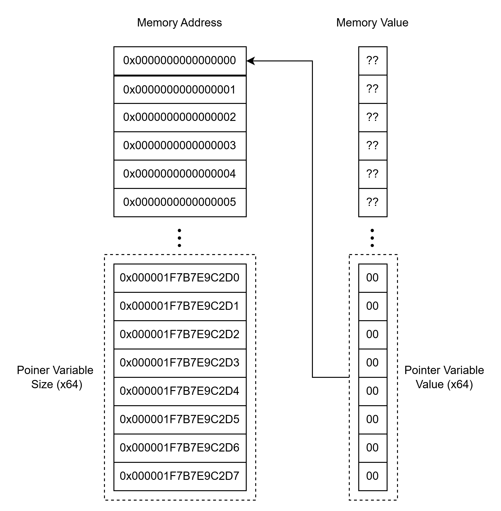

# Pointer (포인터)

## 1. 포인터란 무엇인가?

기본적으로 UE4SS C++ 모드는 대부분의 변수 조작과 함수 호출, UObject 처리를 위해서 포인터를 사용합니다. 따라서, UE4SS로 C++ 모드를 작성하기 위해서는 포인터에 대한 이해가 필수적이라고 할 수 있습니다.

먼저 포인터라는 이름에 대해서 살펴보도록 합시다. 포인터(가리키는 것)이라는 이름 대로, **포인터는 메모리 상의 특정한 지점을 가리키는 역할을 담당합니다.** 예를 들어서, [그림 1]과 같은 식으로 메모리가 구성되어 있다고 합시다. **메모리는 기본적으로 1차원 구조**임을 염두에 두도록 합니다. 이 점은 2차원 이상의 배열을 다룰 때에 중요하게 작용합니다. (모딩하시려는 게임의 자료구조에 따라서, 2차원 이상의 배열이 포함되어 있을 수도 있으니까요!)



[그림 1] 포인터 변수의 이해

[그림 1]은 포인터의 개념을 단순화 시켜서 나타나내고 있습니다. 먼저, 좌측의 Memory Address 부분을 보도록 합시다. 메모리 주소 0x000001F7B7E9C2D0부터 0x000001F7B7E9C2D7까지의 주소에는 각 주소마다 1바이트의 값인 00이 들어있습니다. 여기서 0x000001F7B7E9C2D0~0x000001F7B7E9C2D7 까지의 주소에 있는 값들(8바이트)는 64비트 시스템에서의 포인터 변수의 값이 되고, 0x000001F7B7E9C2D0는 포인터 변수의 시작 주소가 됩니다. 그림에서 확인할 수 있듯이, 포인터 변수의 값은 메모리 상에서의 어느 한 주소를 가리킵니다. 여기서는 nullptr, 즉 0번 주소의 값을 가리키고 있습니다. 위 그림은 아래의 코드를 메모리 관점에서 살펴본 것입니다.

```c++
void* ptr = nullptr;
```

여기서 한 가지 주목할 점은, **64비트 시스템에서의 메모리 주소를 가리키기 위해서는 8바이트(32비트 시스템이라면 4바이트만 있으면 되겠죠!)의 크기만이 필요하다**는 점입니다. 그렇다면 포인터 변수는 자신만의 고유한 타입을 가져야 하는 것 아닐까요? 포인터 변수의 타입은 무엇을 의미하는 것일까요? 생각해보면, `void*`이건, `int*`이건, `double*`이건, 아니면 `SomeComplicatedClass*`이건, 모**든 포인터의 크기는 8바이트(앞으로는 64비트 시스템을 기준으로 설명합니다.)이면 충분합니다.** 그렇다면 왜 특정한 타입의 포인터임을 명시해야 하는 것 일까요?

여기에 대한 답은 바로 포인터 변수가 가리키는 값을 자세히 생각해보면 알 수 있습니다. **포인터 변수에 담겨 있는 값은 기본적으로 특정 메모리 주소를 가리킵니다.** 이 말은 다시 말하자면, **포인터 변수에 담겨 있는 값은 메모리 '범위'나 '영역'을 가리키는 것이 아닙니다.** 만약 우리가 포인터 변수에 역참조 연산자를 사용해서 그 변수의 주소에 있는 값을 읽어오고자 할 때, 컴퓨터는 과연 얼마나 메모리를 읽어와야 한다는 것을 알 수 있을까요? 여기서 바로 포인터의 타입이 사용됩니다.

**포인터의 타입은 '역참조 연산'을 사용했을 때, 얼마나 많은 데이터를 읽어올 것인지를 결정합니다.**